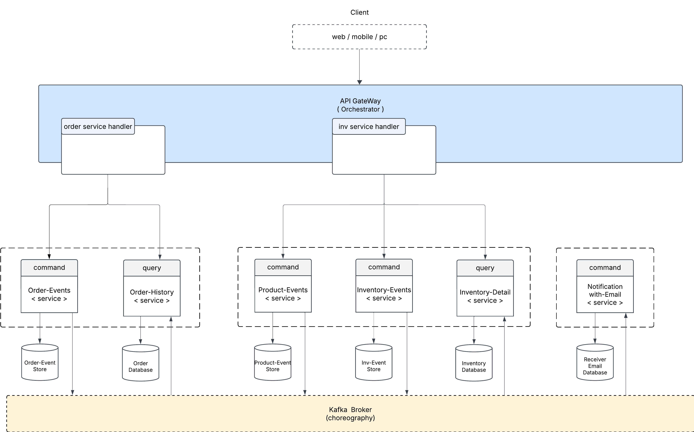

# 🚀 MDD Microservices Architecture

## 📌 Goals / Objectives
- พัฒนา **API Gateway** ด้วย Express (TypeScript)
- พัฒนา **Order Domain** สำหรับจัดการคำสั่งซื้อ
- พัฒนาระบบจัดการคลังสินค้า (**Inventory Domain**)
- พัฒนาระบบแจ้งเตือนคำสั่งซื้อผ่านอีเมล (**Notification Domain**)

---

## 🏗️ System Architecture Overview
**MDD Microservices** ใช้สถาปัตยกรรม **Event-Driven Microservices** โดยใช้ **Kafka** สำหรับ **Event Choreography** และ **Event Sourcing** แบ่งออกเป็น 3 โดเมนหลัก:
- **Order Domain** 📦
- **Inventory Domain** 🏬
- **Notification Domain** 📢

### 🖼️ **System Architecture Diagram**

---

## 🔀 API Gateway Flow Diagram

1. **Client ส่ง Request**  
   - Web/Mobile App/PC ส่งคำขอไปยัง API Gateway

2. **Validate Request**  
   - ตรวจสอบ Payload Validation เช่น ฟอร์แมตของข้อมูลและค่าที่จำเป็น

3. **Rate Limiting**  
   - ตรวจสอบว่าไม่เกิน Rate Limit ที่กำหนด (เช่น 100 requests/min)  
   - หากเกินโควต้า ตอบกลับด้วย **HTTP 429 (Too Many Requests)**

4. **Routing ไปยัง Microservices**  
   - API Gateway ส่ง Request ไปยัง Microservice ที่เกี่ยวข้อง (Order, Inventory, Notification)

5. **Microservice ประมวลผลคำขอ**  
   - ตัวอย่างเช่น สร้างคำสั่งซื้อ, อัปเดตสถานะ, อัปเดตสต็อก

6. **API Gateway ส่ง Response กลับให้ Client**  
   - ส่ง **HTTP 200 OK** หากสำเร็จ  
   - หรือ **HTTP 400/500** หากเกิดข้อผิดพลาด  

---

## 🏷️ Order Domain

🔹 แบ่งออกเป็น **2 Services**  
- **Order-Event-Sourcing-Service (Command)**  
  - รับคำสั่งจาก API Gateway  
  - บันทึก Event ลง **Order Event Store**  
  - ใช้ **Kafka Broker (Choreography)** กระจาย Event ไปยังบริการอื่น  

- **Order-History-Service (Query)**  
  - รับคำขอข้อมูลจาก API Gateway  
  - อ่านข้อมูลจาก **Order Database**  
  - ใช้สำหรับดึงประวัติคำสั่งซื้อโดยไม่กระทบกับระบบคำสั่ง  

---

## 📦 Inventory Domain

🔹 แบ่งออกเป็น **3 Services**  
- **Inventory-Event-Sourcing-Service (Command)**  
  - รับคำสั่งจาก API Gateway  
  - บันทึก Event ลง **Inventory Event Store**  
  - ใช้ **Kafka Broker (Choreography)** กระจาย Event ไปยังบริการอื่น  

- **Product-Event-Sourcing-Service (Command)**  
  - รับคำสั่งจาก API Gateway  
  - บันทึก Event ลง **Product Event Store**  
  - ใช้ **Kafka Broker (Choreography)**  

- **Inventory-Detail-Service (Query)**  
  - รับคำขอข้อมูลจาก API Gateway  
  - อ่านข้อมูลจาก **Inventory Details Database**  
  - ใช้สำหรับดึงข้อมูลสินค้าคงคลังโดยไม่กระทบกับระบบคำสั่ง  

---

## 🔔 Notification Domain

🔹 แบ่งออกเป็น **2 Services**  
- **Notification with Email Service**  
  - รับ Event จาก **Kafka Broker (Choreography)**  
  - ค้นหาอีเมลผู้รับจาก **Receiver Email Database**  
  - ส่งอีเมลแจ้งเตือนเกี่ยวกับคำสั่งซื้อ  

- **Receiver Email Database**  
  - เก็บข้อมูลอีเมลของผู้รับแจ้งเตือน  
  - ใช้สำหรับค้นหาผู้รับที่ต้องได้รับแจ้งเตือน  

---

## 📌 Technologies Used
| Service | Technology Stack |
|---------|----------------|
| **API Gateway** | Express, TypeScript |
| **Order Service** | Go, Kafka, PostgreSQL |
| **Inventory Service** | Go, Kafka, PostgreSQL |
| **Notification Service** | Node.js, Kafka, SMTP |

---
